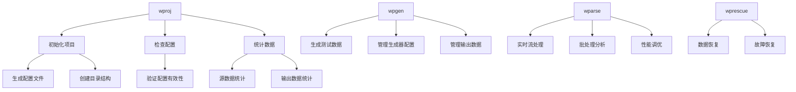

# CLI 工具概览

本文档介绍 Dayu-Veyron ETL 引擎提供的一套命令行工具，包括数据解析、生成、项目管理和数据恢复等功能。

## 工具总览

### 核心工具

| 工具 | 功能描述 | 主要用途 |
|------|---------|---------|
| **wparse** | 数据解析引擎 | 实时数据流处理、批处理分析 |
| **wpgen** | 数据生成器 | 基于规则或样本生成测试数据 |
| **wproj** | 项目管理工具 | 项目初始化、配置管理、数据统计 |
| **wprescue** | 数据恢复工具 | 从救援目录恢复处理失败的数据 |

## 快速参考

### wparse - 数据解析引擎

```bash
# 守护进程模式（持续运行）
wparse daemon --work-root ./myproject --stat-print

# 批处理模式
wparse batch --work-root ./myproject --max-line 10000 --stat 5

# 常用参数
# --work-root, -w: 工作根目录（默认：.）
# --mode, -m: 执行模式（p=精确，默认；a=自动）
# --max-line, -n: 最大处理行数
# --parse-workers: 并发解析 worker 数
# --check-stop, -S: 错误停止阈值
# --check-continue, -s: 错误继续阈值
# --robust: 鲁棒模式（develop/alpha/beta/online/crucial）
# --print-stat, -p: 周期性打印统计信息
# --log-profile: 日志预设（dev/int/prod）
# --wpl: 覆盖 WPL 模型目录
```

### wpgen - 数据生成器

```bash
# 基于规则生成数据
wpgen rule --work-root ./myproject --print-stat --line-cnt 10000

# 基于样本生成数据
wpgen sample --work-root ./myproject --line-cnt 5000

# 配置管理
wpgen conf init
wpgen conf check
wpgen conf clean

# 数据管理
wpgen data clean
wpgen data check

# 常用参数
# --work-root, -w: 工作根目录（默认：.）
# --wpl: 覆盖 WPL 规则目录
# --conf-name, -c: 配置文件名（默认：wpgen.toml）
# --print-stat, -p: 周期性打印统计信息
# --line-cnt, -n: 总行数覆盖
# --gen-speed, -s: 生成速度覆盖（行/秒）
# --stat: 统计输出间隔（默认：1秒）
```

### wproj - 项目管理工具

```bash
# 项目初始化
wproj init --mode full

# 项目检查
wproj check

# 数据清理
wproj data clean

# 统计功能
wproj stat file
wproj stat file --output json

# 模型管理
wproj model list
wproj model validate

# 规则工具
wproj rule parse --rule-id myrule
wproj rule test --input sample.log

# 配置管理
wproj sinks list
wproj sinks validate
wproj sinks route

# 常用参数
# --work-root, -w: 工作根目录（默认：.）
# --mode: 模式（base=conf+data, env=base+connectors, full=env+models）
```

### wprescue - 数据恢复工具

```bash
# 批处理模式恢复数据
wprescue batch --work-root ./myproject

# 常用参数
# --work-root, -w: 工作根目录（默认：.）
# --mode: 执行模式（p=精确，默认；a=自动）
# --max-line, -n: 最大处理行数
# --robust: 鲁棒模式
```

## 通用参数

所有 CLI 工具都支持以下通用参数：

| 参数 | 简写 | 描述 | 默认值 |
|------|------|------|--------|
| `--work-root` | `-w` | 工作根目录 | `.` |
| `--log-profile` | | 日志预设（dev/int/prod） | 使用配置文件设置 |
| `--help` | `-h` | 显示帮助信息 | |
| `--version` | `-V` | 显示版本信息 | |

## 环境变量

| 变量名 | 描述 |
|--------|------|
| `WP_PARSE_ROBUST` | 设置全局鲁棒模式 |
| `WP_PARSE_LOG_LEVEL` | 覆盖日志级别 |
| `RUST_LOG` | Rust 日志级别（调试用） |

## 退出码

| 退出码 | 含义 |
|--------|------|
| 0 | 成功 |
| 1 | 通用错误 |
| 2 | 配置错误 |
| 3 | 数据错误 |
| 4 | 网络错误 |
| 5 | 权限错误 |

## 工具关系图



## 下一步

- [快速入门指南](01-getting_started.md) - 从零开始配置项目
- [wparse 运行模式](02-run_modes.md) - daemon 和 batch 模式详解
- [wpgen 使用指南](03-wpgen.md) - 数据生成工具使用说明
- [wproj 项目管理](04-wproj.md) - 项目管理工具详细说明
- [wprescue 数据恢复](05-wprescue.md) - 数据恢复工具使用
- [日志设置与问题定位](06-logging.md) - 日志配置和故障排除

## 技术架构

CLI 工具采用 Rust 编写，使用 clap 框架处理命令行参数，tokio 异步运行时。核心功能通过 `wp-engine` 库的 facade 模式对外暴露，确保 API 稳定性和向后兼容性。

### 项目结构

```
warp-parse/
├── src/
│   ├── wparse/          # 数据解析引擎
│   │   └── main.rs
│   ├── wpgen/            # 数据生成器
│   │   ├── main.rs
│   │   ├── cli.rs       # CLI 定义
│   │   ├── rule.rs      # 规则生成逻辑
│   │   ├── sample.rs    # 样本生成逻辑
│   │   ├── conf.rs      # 配置管理
│   │   └── data.rs      # 数据管理
│   ├── wproj/            # 项目管理
│   │   └── main.rs
│   └── wprescue/         # 数据恢复
│       └── main.rs
└── wp-engine/            # 核心引擎库
    └── facade/args.rs    # 参数定义
```

这种设计确保了：
1. **模块化**：每个工具职责单一，易于维护
2. **复用性**：核心功能通过库共享
3. **可扩展性**：便于添加新的 CLI 工具