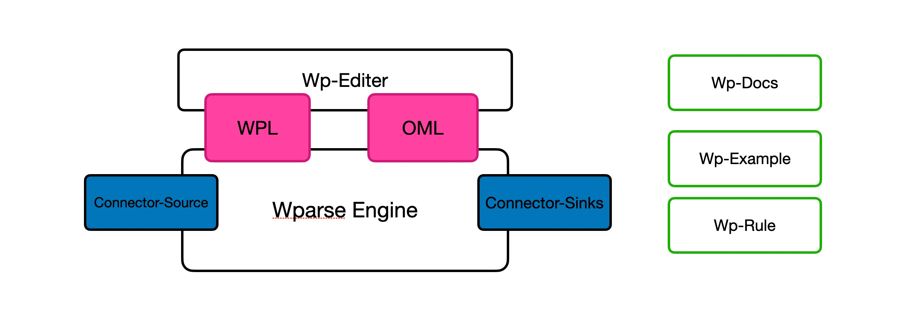

# WarpPase 学习指南

## 日志处理过程

## WarpPase 是什么？
WarpParse 是当前最强性能的ETL引擎(2026)。它采用 Rust 语言构建，突破通用数据管道工具的性能瓶颈的轻量高性能的怪兽，合适应用于可观测性、安全、实时风控等领域。

## 为什么需要WarpParse?

随着云计算与物联网技术的飞速发展，企业产生的系统日志、网络流量及安全审计数据呈现出爆炸式增长。这些日志通常具有异构性强、嵌套深度大、格式变体多等特点。
以正则表达式
### 正则表达式的解析方案：

* 正则表达式的匹配逻辑具有“全有或全无”的特性，解析错误难以定位
* 逻辑分支与可选字段处理能力较弱
* 无法原生处理嵌套与复合协议，如JSON、KV（键值对）、Array 等嵌套结构。
* 回溯机制导致的计算冗余： 
* 可读性与维护成本挑战： 正则表达式被戏称为“只写语言”，其密集的转义符和捕获组严重阻碍了代码的可读性

### 程序解析方案
* 单种日志的解析，需要天为单复，复杂日志达到周的开发时间
* 对开发环境有强依赖，从获取数据样本到在线成功解析，周期长

### 性能不足
基于Java的解析方案，在达到 10W EPS，通常需要 40C ，80G内存的计算资源。

## 结构

### WPL 
WPL（Warp Programming Language） 是一种专门用于定义数据抽取规则的领域特定语言，应用于 Warp Parse，用于将非结构化或半结构化的文本数据转化为结构化信息, 具有远超于正则表达式的解析能力、前序后序管道处理和高可读性。

### 1. 远超正则表达式的解析能力
WPL 不仅仅是简单的文本匹配，它通过内置的丰富数据类型和逻辑元信息实现了对复杂结构的深度解析：
• 内置协议支持：支持 JSON、KV（键值对）、Array、HTTP 请求（request/status/agent）以及各种网络类型（IP、MAC、Email、URL），能够直接处理嵌套和半结构化协议。
• 智能匹配逻辑：通过 alt（择一匹配，用于容错）、some_of（尽可能多地匹配，用于扫描零散键值）和 opt（可选匹配）等元信息，WPL 能够处理正则表达式难以应对的非固定顺序或可选字段场景。
• 长度与范围控制：支持通过 [N] 限定最大长度，或通过 <beg,end> 定义字段的定界符。
### 2. 双层管道（Pipe）处理机制
你提到的“前序后序管道”在 WPL 中体现为两个独立的作用域：
• 表达式级预处理管道（Pre-processing Pipe）：位于规则起始处，作用于整行原始输入。它常用于执行 Base64 解码、十六进制解码或反转义（unquote/unescape），将原始数据转换为可解析的文本。
• 字段级管道（Field Pipe）：作用于单个解析后的字段。它不仅能进行二次转换（如字符串模式切换），还能执行合法性验证，例如检查字段是否存在（exists）、数值是否在特定范围内、或 IP 地址是否在白名单内。
### 3. 结构化与高可读性
WPL 的设计初衷是为了让复杂的规则易于维护和理解：
• 层级结构：采用 Package（包） > Rule（规则） > Group（分组） > Field（字段） 的组织形式，包名作为作用域，便于规则复用和管理
## OML
OML 是一种对象构建语言，专门设计用于对解析后的数据进行组装与聚合。它的核心目标是将离散、结构化的输入数据，通过预定义的逻辑转换，生成所需的输出格式，通常为嵌套的 JSON 对象，
具有声明式语法和 SQL 集成

### WpEngine

🚀 极致吞吐： 众多场景下性能全面超越 Vector（详见 docs/performance.md）。
🛠️ 运维友好： 单二进制部署，配置化；提供 wproj、wpgen、wprescue 工具套件。
🧠 知识转换： 通过内存数据库支持 SQL 查询，实现数据富化。
🎯 数据路由： 基于规则和转换模型进行路由，支持多路复制与过滤器。

### WpConnector

基于 wp-connector-api，便于社区生态扩展。

#### 消息对列
* kafka
#### 存储
* mysql
* Doris
#### 搜索
* ES

## WpExample 
提供 20+ 的示例，方便进行验证和学习使用 WarpParse

## WpRule
