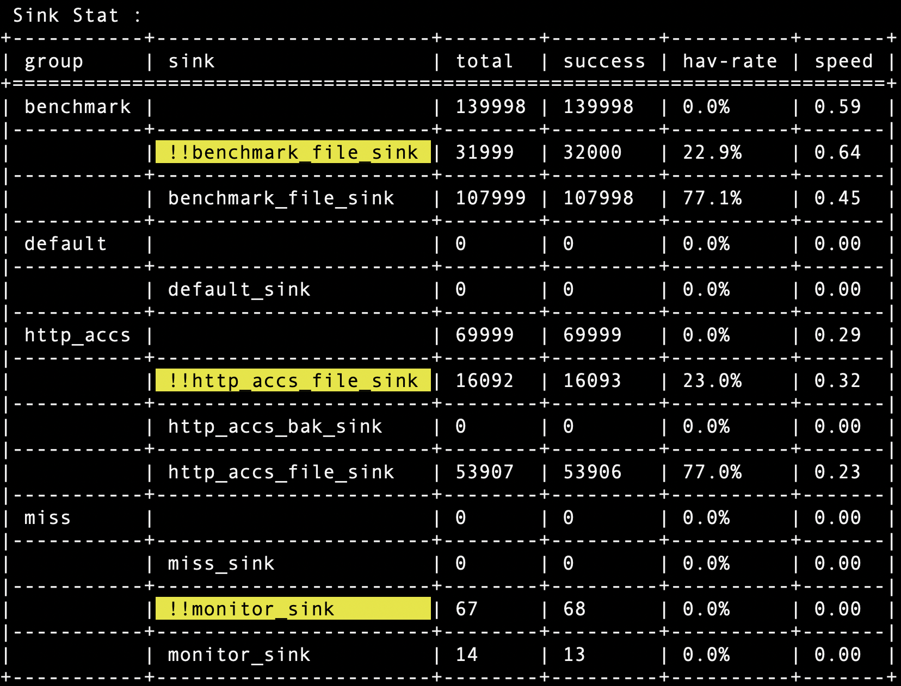

# 监控




###  config
``` toml
[[sink_route.monitor.sinks]]
name = "monitor_sink"

[sink_route.monitor.sinks.fmt]
fmt = "kv"

[sink_route.monitor.sinks.target.file]
path = "./out/monitor.dat"   
```


* 可以设置不同的 sink 类型.


### 告警 

可以配置 wpflow.moni 对于监控统计的数据进行告警

#### 配置示例
```
    error {
        cond { 
          $name == chars(!!http_accs_file_sink) &&   ( $hav_rate >  float(70.0)  || $hav_rate < float(40.0) )
        }
        prompt { "http_accs_file donw  rate not in [40,70]" }
        usecase { end_sum }
    }

    error {
        cond { 
          $name == chars(!!benchmark_file_sink) &&   ( $hav_rate >  float(70.0)  || $hav_rate < float(40.0) )
        }
        prompt { "benchmark_file_sink donw  rate not in [40,70]" }
        usecase { end_sum }
    }
```

#### 配置语法

```
warn  | error | fatal {
    cond { ... }
    prompt {... }
    usecase { end_sum | realtime }
}
```

#### 告警示例
```
======================= sum up check ===========================
D0:  stat                                     > error:benchmark_file_sink donw  rate not in [40,70]
D0:  stat                                     > data:
NO:1          [digit           ] type                 : 3
NO:2          [chars           ] name                 : !!benchmark_file_sink
NO:3          [chars           ] group                : benchmark
NO:4          [digit           ] total                : 1332
NO:5          [digit           ] success              : 1333
NO:6          [float           ] suc_rate             : 100.07508
NO:7          [float           ] hav_rate             : 19.981998
NO:8          [float           ] speed                : 267.77823
NO:9          [digit           ] moni_notify          : 3
NO:10         [chars           ] moni_prompt          : benchmark_file_sink donw  rate not in [40,70]

D0:  stat                                     > error:http_accs_file donw  rate not in [40,70]
D0:  stat                                     > data:
NO:1          [digit           ] type                 : 3
NO:2          [chars           ] name                 : !!http_accs_file_sink
NO:3          [chars           ] group                : http_accs
NO:4          [digit           ] total                : 665
NO:5          [digit           ] success              : 666
NO:6          [float           ] suc_rate             : 100.15037
NO:7          [float           ] hav_rate             : 19.951994
NO:8          [float           ] speed                : 133.78867
NO:9          [digit           ] moni_notify          : 3
NO:10         [chars           ] moni_prompt          : http_accs_file donw  rate not in [40,70]
```