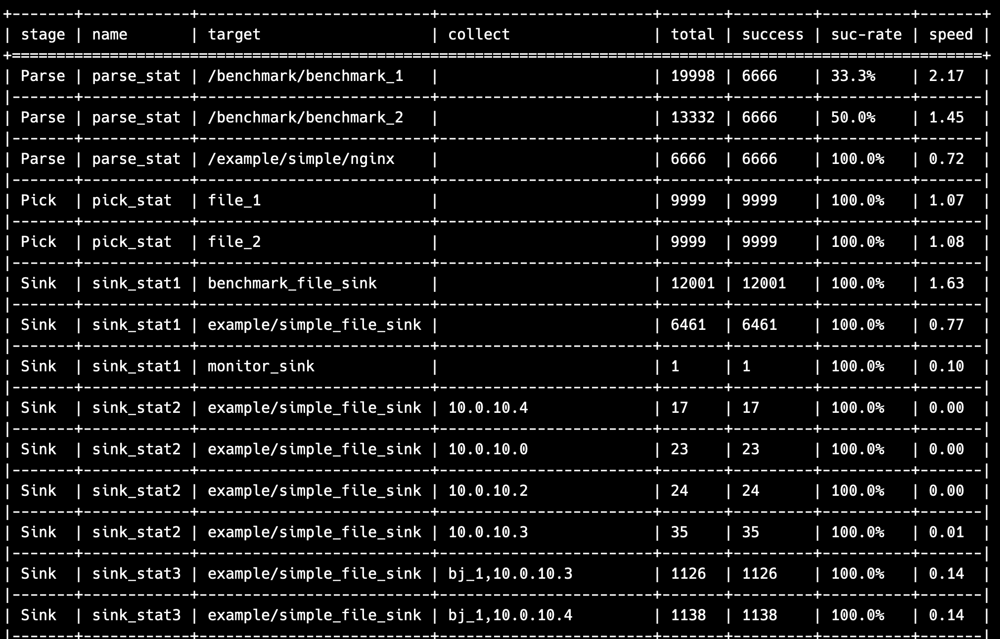

# 运行统计


参考  usecase/stat_example

## 配置示例

```toml
[[stat_conf.items]]
name  = "sink_stat1"
stage = "sink"
target = "all"
max = 5


[[stat_conf.items]]
name  = "sink_stat3"
stage = "sink"
target = "example/simple_file_sink"
collect = ["pos_sn","sip"]
max = 4

[[stat_conf.items]]
name  = "sink_stat4"
stage = "sink"
target = "example/simple_file_sink"
collect= ["pos_sn","sip", "data_type"]
```

## 配置说明

* name 统计名称, 保持唯一
* stage 运行阶段, 包括:  gen,pick, parse, sink
* target 统计目标, 它是:
  *  parse的全部规则(all), 也可以是具体规则. 
  * 全部sink (all),也可以是具体的sink
* collect 统计采集的数据

##  简单展示:




## 输出数据

pos_sn, sip, data_type 是 collect 的数据字段.

```csv
stage:Sink, name:sink_stat4, target:example/simple_file_sink, pos_sn:bj_1, sip:10.0.10.3, data_type:app_log, total:1245, success:1245, suc_rate:100, speed:0.1491018, beg_time:2024-07-11 09:56:05.388508, end_time:2024-07-11 09:56:06.222974
stage:Sink, name:sink_stat4, target:example/simple_file_sink, pos_sn:bj_1, sip:10.0.10.4, data_type:app_log, total:1261, success:1261, suc_rate:100, speed:0.15101796, beg_time:2024-07-11 09:56:05.388501, end_time:2024-07-11 09:56:06.223005
stage:Sink, name:sink_stat4, target:example/simple_file_sink, pos_sn:bj_1, sip:10.0.10.2, data_type:app_log, total:1273, success:1273, suc_rate:100, speed:0.15245509, beg_time:2024-07-11 09:56:05.388515, end_time:2024-07-11 09:56:06.223036
stage:Sink, name:sink_stat4, target:example/simple_file_sink, pos_sn:bj_1, sip:10.0.10.1, data_type:app_log, total:1312, success:1312, suc_rate:100, speed:0.15712574, beg_time:2024-07-11 09:56:05.388481, end_time:2024-07-11 09:56:06.222999
stage:Sink, name:sink_stat4, target:example/simple_file_sink, pos_sn:bj_1, sip:10.0.10.0, data_type:app_log, total:1370, success:1370, suc_rate:100, speed:0.16407186, beg_time:2024-07-11 09:56:05.388458, end_time:2024-07-11 09:56:06.222992
stage:Sink, name:sink_stat3, target:example/simple_file_sink, pos_sn:bj_1, sip:10.0.10.3, total:1126, success:1126, suc_rate:100, speed:0.13748474, beg_time:2024-07-11 09:56:05.404220, end_time:2024-07-11 09:56:06.222971

```

